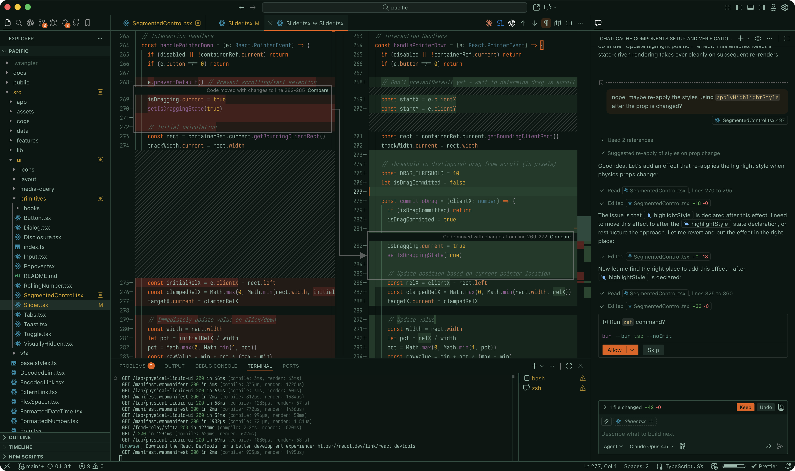

# NERV

A dark editor theme inspired by 80s/90s cyberpunk interfaces, Evangelion's NERV headquarters, and the green-tinted cinematography of Wong Kar-wai. Industrial control terminals meet the melancholic warmth of *In the Mood for Love*.



## The Aesthetic

Deep oceanic greens meet warning-sign orange. Phosphor glow on aging CRT monitors. The quiet hum of a command terminal in an underground facility. Film grain over midnight corridors.

**Color Philosophy:**
- **Background**: Deep sea darkness (`#0a1612`) — the void behind the glass
- **Foreground**: Muted sage (`#8fb3a5`) — easy on the eyes during extended operations
- **Accent**: Signal orange (`#e85d04`) — urgent, alive, impossible to ignore
- **Functions**: Subdued purple (`#8a5a8a`) — mysterious systems at work
- **Types**: Industrial teal (`#3a7a8c`) — structural, foundational
- **Strings**: Organic green (`#4a8c5c`) — data in motion

## Installation

### VS Code

1. Open VS Code
2. Go to Extensions (`Cmd+Shift+X` / `Ctrl+Shift+X`)
3. Search for "NERV Theme"
4. Click Install
5. Open Command Palette (`Cmd+Shift+P` / `Ctrl+Shift+P`)
6. Select "Preferences: Color Theme" → "NERV"

**Manual Installation:**
```bash
# Copy the extension folder to your VS Code extensions directory
cp -r vscode-extension ~/.vscode/extensions/nerv-theme
```

### Zed

1. Open Zed
2. Open Extensions (`Cmd+Shift+X`)
3. Search for "NERV"
4. Click Install

**Manual Installation:**
```bash
# Copy the theme to your Zed themes directory
mkdir -p ~/.config/zed/themes
cp zed-extension/themes/nerv.json ~/.config/zed/themes/
```

Then open Command Palette and select "theme: Select Theme" → "NERV".

## Color Palette

| Role | Hex |
|------|-----|
| Background | `#0a1612` |
| Foreground | `#8fb3a5` |
| Accent | `#e85d04` |
| Functions | `#8a5a8a` |
| Types | `#3a7a8c` |
| Strings | `#4a8c5c` |
| Numbers | `#d4a017` |
| Comments | `#4a6a5d` |

## Inspiration

This theme draws from:

- **Neon Genesis Evangelion** — NERV headquarters, MAGI supercomputer terminals
- **80s/90s cyberpunk** — command centers, surveillance systems, industrial control rooms
- **Wong Kar-wai** — the green-tinted melancholy of *In the Mood for Love*, *Chungking Express*
- **CRT phosphor aesthetics** — the glow of late-night terminal sessions

The goal is capturing a *feeling*—the weight of solitude in a darkened room, information flowing across screens, the human operator at the center of vast systems.

## Contributing

Contributions are welcome! If you'd like to port NERV to additional editors or improve existing themes, please open a PR.

## Credits

Created by [Jane Manchun Wong](https://wongmjane.com), synthesized with [Claude Code](https://claude.ai/code) (Opus 4.5).

## License

MIT License — See [LICENSE](LICENSE) for details.
